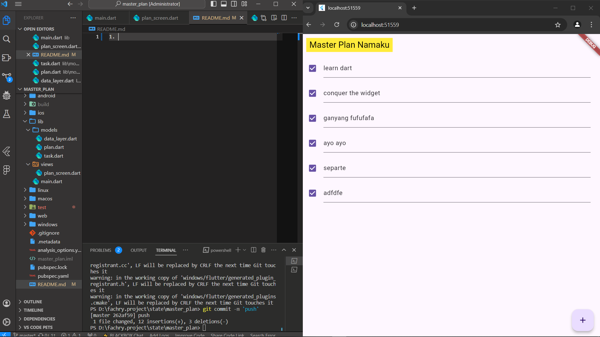

# NAMA  : FACHRY DWI ZAKARIA
1. 
2. Maksud dari Langkah 4
Pada langkah 4, kita membuat file data_layer.dart di dalam folder models untuk mengimpor model Plan dan Task. File ini menggunakan perintah export untuk mengekspor beberapa model dalam satu file.

Alasan:

File data_layer.dart bertindak sebagai data layer aggregator, yaitu file yang menyatukan semua model terkait yang mungkin dibutuhkan di berbagai bagian aplikasi.
Dengan adanya file ini, kita hanya perlu mengimpor data_layer.dart di tempat lain, dan secara otomatis semua model (Task, Plan, dll.) yang diekspor dari file tersebut bisa langsung digunakan.
3. Mengapa Perlu Variabel plan di Langkah 6 dan Mengapa Dibuat Konstanta?
Pada langkah 6, variabel plan dideklarasikan sebagai Plan plan = const Plan(); di dalam kelas _PlanScreenState.

Alasan:

Variabel plan menyimpan state dari daftar tugas pengguna di dalam aplikasi. Ini merupakan representasi dari data yang ditampilkan di layar dan bisa diubah saat pengguna menambah, mengedit, atau menandai tugas.
Plan dibuat sebagai konstanta (const Plan()) karena pada awalnya, plan kosong atau belum memiliki data apa pun. Menjadikannya konstanta memungkinkan kita membuat instance Plan dengan nilai default (kosong) tanpa membuat aplikasi mengalokasikan ulang memori untuk objek yang identik.
Ketika tugas ditambahkan atau diperbarui, kita mengganti nilai plan dengan objek Plan baru, jadi penggunaan const awal tidak menghambat pengelolaan state.
4. Kegunaan Method pada Langkah 11 (initState) dan 13 (dispose) dalam Lifecycle State
Langkah 11 (initState): Method initState() dipanggil sekali ketika instance widget dibuat. Pada langkah ini, initState() digunakan untuk menginisialisasi scrollController dan menetapkan listener untuk menghapus fokus dari TextField ketika pengguna menggulir layar.

Tujuan:

Untuk memastikan bahwa saat pengguna menggulir, keyboard tidak menghalangi tampilan karena fokus otomatis dilepas dari input field.
Langkah 13 (dispose): Method dispose() dipanggil ketika widget dihapus dari widget tree dan sudah tidak digunakan. Dalam dispose(), kita memanggil scrollController.dispose() untuk membersihkan sumber daya yang dipakai oleh scrollController.

Tujuan:

Untuk mencegah memory leak dengan memastikan bahwa semua controller atau listener yang tidak lagi dibutuhkan dihentikan ketika widget dihapus.
Method initState dan dispose adalah bagian penting dari lifecycle stateful widget di Flutter, karena mereka membantu dalam pengaturan dan pembersihan sumber daya yang diperlukan widget selama masa hidupnya.